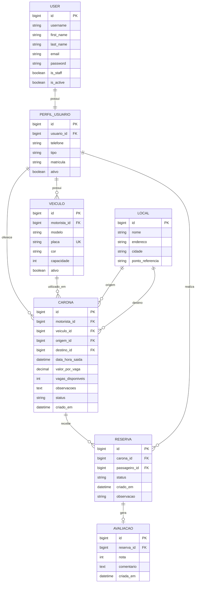

# Modelagem Entidade-Relacionamento

Sistema de agendamento de caronas.

## Entidades

| Entidade | Descricao |
| --- | --- |
| `User` | Usuario autenticavel do Django, usado para login e permissao de acesso. |
| `PerfilUsuario` | Complementa o usuario com telefone, tipo de uso e matricula. |
| `Veiculo` | Veiculo cadastrado por um motorista para oferecer caronas. |
| `Local` | Ponto de origem ou destino das caronas. |
| `Carona` | Oferta de viagem cadastrada por um motorista, com rota, horario, valor e vagas. |
| `Reserva` | Solicitacao ou confirmacao de vaga feita por um passageiro. |
| `Avaliacao` | Nota e comentario associados a uma reserva realizada. |

## Regras e Cardinalidades

| Relacionamento | Cardinalidade | Regra |
| --- | --- | --- |
| `User` - `PerfilUsuario` | 1:1 | Cada usuario possui um unico perfil complementar. |
| `PerfilUsuario` - `Veiculo` | 1:N | Um motorista pode cadastrar varios veiculos. |
| `PerfilUsuario` - `Carona` | 1:N | Um motorista pode oferecer varias caronas. |
| `Veiculo` - `Carona` | 1:N | Um veiculo pode ser usado em varias caronas. |
| `Local` - `Carona` | 1:N | Um local pode aparecer como origem ou destino em varias caronas. |
| `Carona` - `Reserva` | 1:N | Uma carona pode receber varias reservas. |
| `PerfilUsuario` - `Reserva` | 1:N | Um passageiro pode realizar varias reservas. |
| `Reserva` - `Avaliacao` | 1:0..1 | Uma reserva pode ter no maximo uma avaliacao. |

## Principais Restricoes

- A placa do veiculo deve ser unica.
- Um usuario so pode ter um perfil.
- A mesma pessoa nao pode reservar a mesma carona mais de uma vez.
- Origem e destino da carona devem ser diferentes.
- O motorista nao pode reservar vaga na propria carona.
- Nao e permitido confirmar reservas acima do numero de vagas disponiveis.
- A nota da avaliacao deve estar entre 1 e 5.
